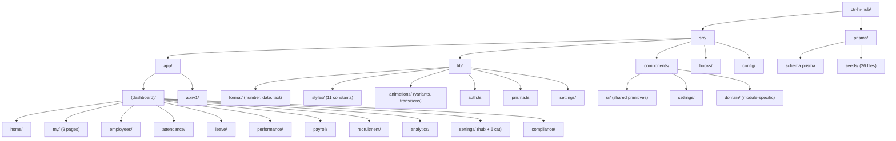
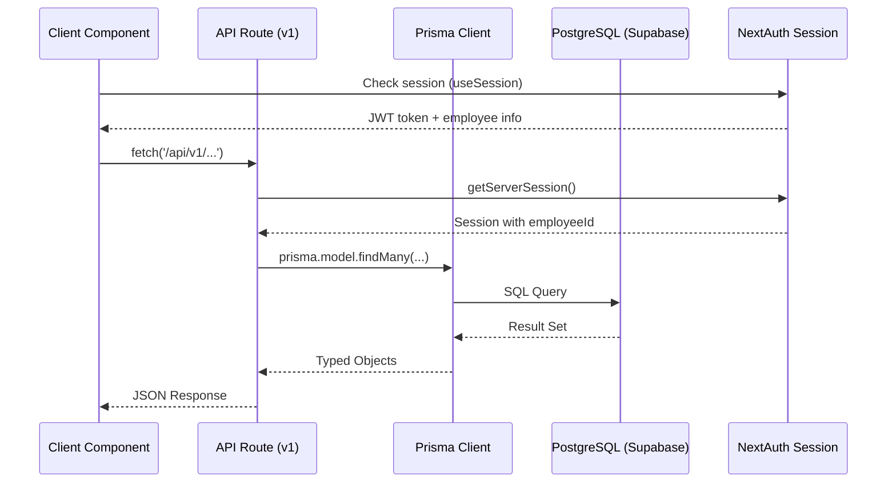
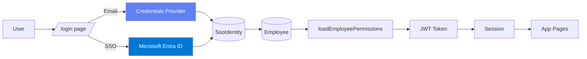
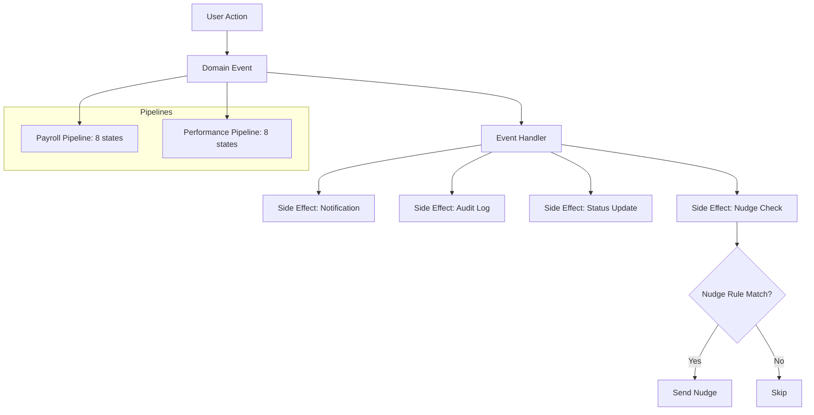

# Architecture Overview — CTR HR Hub

> Generated from codebase analysis (2026-03-12, Q-1)

---

## Folder Structure

---

## Data Flow

---

## Auth Flow

---

## Event Pipeline

---

## Key File Reference

| Category | File | Purpose |
|----------|------|---------|
| **Auth** | `src/lib/auth.ts` | NextAuth config (Entra ID + Credentials) |
| **DB** | `src/lib/prisma.ts` | Prisma singleton (PrismaPg adapter) |
| **Navigation** | `src/config/navigation.ts` | Sidebar menu structure (749 lines) |
| **Settings** | `src/components/settings/settings-config.ts` | Settings hub tab definitions |
| **Process Settings** | `src/hooks/useProcessSetting.ts` | Hook for process settings API |
| **Middleware** | `src/middleware.ts` | Security headers (CSP, HSTS) |
| **Layout** | `src/app/(dashboard)/layout.tsx` | Dashboard layout with sidebar |
| **Format** | `src/lib/format/index.ts` | Number, date, text utilities |
| **Styles** | `src/lib/styles/index.ts` | 11 style constant modules |
| **Animations** | `src/lib/animations/variants.ts` | framer-motion animation presets |

---

## Module Overview (152 pages)

| Module | Pages | Key Features |
|--------|:-----:|-------------|
| Home | 1 | Dashboard with KPI cards, task widget |
| My Space | 12 | Personal profile, tasks, leave, payroll, goals |
| Employees | 8 | Directory, detail, contracts, work permits |
| Attendance | 6 | Clock, shift calendar, roster, team view |
| Leave | 5 | Request, admin, team, calendar |
| Performance | 20 | Cycles, goals, evaluations, peer review, calibration |
| Payroll | 12 | Runs, simulation, bank transfers, year-end |
| Recruitment | 10 | Jobs, pipeline, applicants, talent pool |
| Onboarding | 6 | Checklist, templates, check-in |
| Offboarding | 4 | Exit interview, tracking |
| Analytics | 14 | Workforce, payroll, turnover, AI report |
| Settings | 7 | Hub + 6 categories (44 tabs) |
| Compliance | 7 | GDPR, data retention, DPIA, PII audit |
| Other | 40 | Compensation, succession, training, discipline, etc. |
