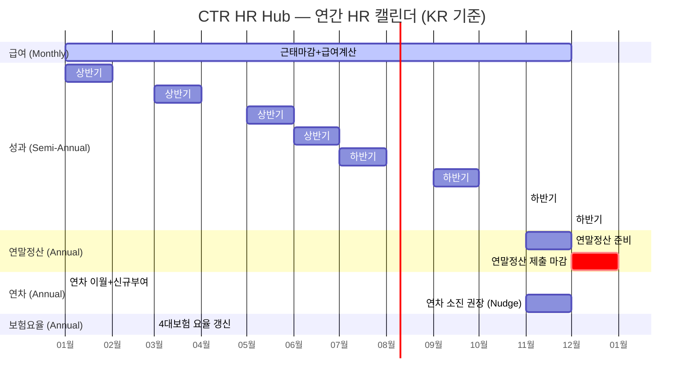

# CTR HR Hub — HR Operations Calendar (Q-0)

> 스캔일: 2026-03-12
> 파이프라인 로직에서 추출 후 월별/주별 타임라인으로 재구성

---

## Annual View (연간 주요 이벤트)



---

## Monthly Recurring Tasks

| 일정 | 주기 | 담당 | 관련 페이지 | Cron/API |
|------|------|------|------------|----------|
| 근태 마감 | 매월 말일 | HR Admin | `/payroll/close-attendance` | `/api/v1/payroll/runs/*/close-attendance` |
| 급여 계산 (batch) | 마감 후 1~3일 | System | `/payroll` | `batch.ts` → CALCULATING → REVIEW |
| 이상 검토 | 계산 완료 후 | HR Admin | `/payroll/anomalies` | `anomaly-detector.ts` |
| 수동 조정 | 이상 검토 후 | HR Admin | `/payroll/adjustments` | PUT `/api/v1/payroll/[runId]/adjustments` |
| 급여 승인 | 조정 완료 후 | CFO/HR | `/payroll/[runId]/approve` | PUT approve |
| 급여 발행 | 승인 후 | HR Admin | `/payroll/[runId]/publish` | 명세서 발송 |
| 이체 파일 생성 | 발행 후 | HR Admin | `/payroll/bank-transfers` | CSV 다운로드 |

### Monthly Payroll Pipeline Flow

```
D-5    근태마감 (ATTENDANCE_CLOSED)
       ↓ emit: PAYROLL_ATTENDANCE_CLOSED → HR Admin 알림
       
D-3    급여 계산 (CALCULATING → REVIEW)
       ↓ emit: PAYROLL_CALCULATED → HR 알림
       ↓ anomaly-detector 실행
       
D-2    이상 검토 + 수동 조정 (REVIEW ↔ ADJUSTMENT)
       ↓ nudge: payroll-review if 대기 중
       
D-1    승인 (APPROVED)
       ↓ emit: PAYROLL_APPROVED → 관련자 알림
       
D-0    발행 + 이체 (PAID)
```

---

## Semi-Annual Performance Cycle (KR/CN/VN)

| Phase | Duration | Status | 관련 페이지 | Nudge |
|-------|----------|--------|------------|-------|
| 목표 설정 | 2~3주 | DRAFT → ACTIVE | `/performance/cycles/[id]`, `/performance/goals` | goal-overdue (D-7: 3d×2, D-3: 1d×3) |
| 중간 체크인 | 2~4주 | ACTIVE → CHECK_IN | `/performance/my-checkins`, `/performance/one-on-one` | — |
| 자기평가 | 1~2주 | CHECK_IN → EVAL_OPEN | `/performance/self-eval`, `/performance/my-evaluation` | eval-overdue (D-5: 2d×2) |
| 매니저 평가 | 1~2주 | EVAL_OPEN | `/performance/manager-eval` | eval-overdue |
| 동료 평가 | 1~2주 (병행) | EVAL_OPEN | `/performance/peer-review/*` | — |
| 캘리브레이션 | 1~2주 | EVAL_OPEN → CALIBRATION | `/performance/calibration` | calibration-pending (3d+ → 2d마다) |
| 결과 확정 | 1~3일 | CALIBRATION → FINALIZED | `/performance/results` | — |
| 결과 공개 | 즉시 | FINALIZED → CLOSED | `/performance/my-result` | — |
| 보상 리뷰 | 2~4주 | CLOSED → COMP_REVIEW | `/performance/comp-review` | — |

### Performance Cycle State Machine

```
DRAFT → ACTIVE → CHECK_IN → EVAL_OPEN → CALIBRATION → FINALIZED → CLOSED → COMP_REVIEW
  │                                         │
  └── advanceCycle() per transition ─────────┘
      13 events emitted at key transitions
      Auto-advance check on MANAGER_EVAL_SUBMITTED (all evals done?)
```

---

## Weekly Recurring Tasks

| 일정 | 주기 | 담당 | 관련 | Trigger |
|------|------|------|------|---------|
| 52시간 상한 모니터링 | 매주 | HR Admin | `/attendance/admin` | 한국법: 주 52시간 초과 감지 |
| 온보딩 체크인 확인 | 매주 | Buddy/HR | `/onboarding/checkins` | nudge: onboarding-checkin-missing |
| 미결 승인 리마인드 | 매주 | Manager | `/approvals/inbox` | nudge: leave-pending, payroll-review |
| Overdue Check (Cron) | 매일 | System | — | `/api/v1/cron/overdue-check` |
| Auto Acknowledge (Cron) | 매일 | System | — | `/api/v1/cron/auto-acknowledge` |
| Eval Reminder (Cron) | 매일 | System | — | `/api/v1/cron/eval-reminder` |
| Org Snapshot (Cron) | 매일 | System | — | `/api/v1/cron/org-snapshot` |

---

## Ad-hoc Operations

| Operation | Trigger | 관련 Pages | Events | Nudges |
|-----------|---------|-----------|--------|--------|
| 신규 입사 | 직원 등록 | `/employees/new` → `/onboarding/[id]` | EMPLOYEE_HIRED | onboarding-overdue, checkin-missing |
| 퇴직 처리 | 오프보딩 시작 | `/offboarding/[id]` → `/my/offboarding` | OFFBOARDING_STARTED | offboarding-overdue, exit-interview-pending |
| 휴가 신청 | 직원 요청 | `/my/leave`, `/leave` → `/approvals/inbox` | LEAVE_APPROVED/REJECTED/CANCELLED | leave-pending |
| 위임 설정 | 매니저 설정 | `/delegation/settings` | — | delegation-not-set |
| AI 리포트 | HR 요청 | `/analytics/ai-report` | — | — |
| 승계 계획 | HR 검토 | `/succession` | — | — |

---

## Annual Special Events (KR Focus)

| 시기 | 이벤트 | 상세 | 관련 Page |
|------|--------|------|----------|
| 1월 | 연차 이월+신규부여 | `balance-renewal.ts`: carry-over 계산 → 신규 부여 | 시스템 자동 |
| 3월 | 4대보험 요율 갱신 | `kr-tax.ts`: 연금/건강/고용/산재 요율 업데이트 | `/settings/payroll` (TaxRatesTab) |
| 11~12월 | 연차 소진 권장 | nudge: leave-yearend-burn (잔여≥3일, 7일마다×3) | `/my/leave` |
| 12~1월 | 연말정산 | `yearEndCalculation.ts`: 원천징수 vs 실제 → 정산 | `/payroll/year-end`, `/my/year-end` |
| 수시 | 근로소득세 간이세액표 | `kr-tax.ts`: `calculateIncomeTax()` | `/payroll` 자동 적용 |

---

## Cron Jobs Summary

| Endpoint | Schedule | 기능 | 관련 Nudge |
|----------|----------|------|------------|
| `/api/v1/cron/overdue-check` | Daily | 전체 overdue 항목 스캔 → nudge 생성 | All 11 rules |
| `/api/v1/cron/auto-acknowledge` | Daily | 읽음 처리 안 된 알림 자동 확인 | — |
| `/api/v1/cron/eval-reminder` | Daily | 평가 마감 임박자 리마인더 | performance-eval-overdue |
| `/api/v1/cron/org-snapshot` | Daily | 조직 구조 스냅샷 (변경 추적) | — |
| `/api/v1/cron/leave-promotion` | Monthly/Annual | 연차 이월+승진 반영 | leave-yearend-burn |
