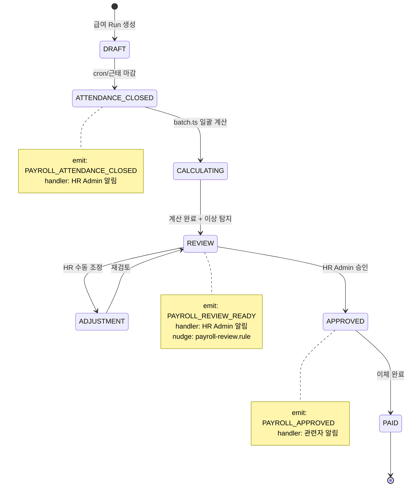
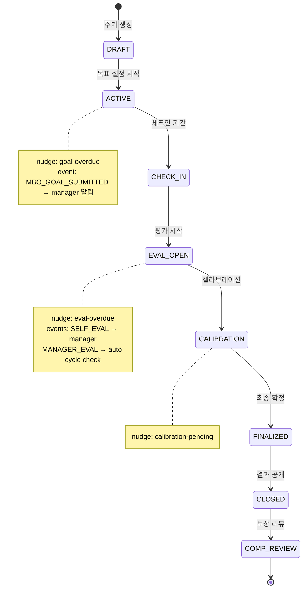

# CTR HR Hub — Event Flow Map (Q-0)

> 스캔일: 2026-03-12 | 13 Event Handlers + 11 Nudge Rules

---

## Event Architecture Overview

```mermaid
flowchart TD
    subgraph Triggers["이벤트 트리거"]
        T1["휴가 승인"]
        T2["휴가 반려"]
        T3["휴가 취소"]
        T4["급여 계산 완료"]
        T5["급여 승인"]
        T6["근태 마감"]
        T7["급여 검토 준비"]
        T8["직원 입사"]
        T9["오프보딩 시작"]
        T10["MBO 목표 제출"]
        T11["MBO 목표 검토"]
        T12["자기평가 제출"]
        T13["매니저평가 제출"]
    end

    subgraph Bus["EventBus (bootstrap.ts)"]
        EB["eventBus.subscribe()"]
    end

    subgraph Handlers["핸들러"]
        H1["leave-approved.handler"]
        H2["leave-rejected.handler"]
        H3["leave-cancelled.handler"]
        H4["payroll-calculated.handler"]
        H5["payroll-approved.handler"]
        H6["payroll-attendance-closed.handler"]
        H7["payroll-review-ready.handler"]
        H8["employee-hired.handler"]
        H9["offboarding-started.handler"]
        H10["mbo-goal-submitted.handler"]
        H11["mbo-goal-reviewed.handler"]
        H12["self-eval-submitted.handler"]
        H13["manager-eval-submitted.handler"]
    end

    subgraph SideEffects["사이드 이펙트"]
        SE1["📧 알림 (Notification)"]
        SE2["📊 잔여일수 업데이트"]
        SE3["🔄 상태 변경"]
        SE4["📋 온보딩 태스크 생성"]
        SE5["📋 오프보딩 태스크 생성"]
        SE6["✅ 자동 상태 전환 체크"]
    end

    T1 -->|emit| EB --> H1 --> SE1 & SE2
    T2 -->|emit| EB --> H2 --> SE1
    T3 -->|emit| EB --> H3 --> SE1 & SE2
    T4 -->|emit| EB --> H4 --> SE1
    T5 -->|emit| EB --> H5 --> SE1
    T6 -->|emit| EB --> H6 --> SE1
    T7 -->|emit| EB --> H7 --> SE1
    T8 -->|emit| EB --> H8 --> SE1 & SE4
    T9 -->|emit| EB --> H9 --> SE5
    T10 -->|emit| EB --> H10 --> SE1
    T11 -->|emit| EB --> H11 --> SE1
    T12 -->|emit| EB --> H12 --> SE1
    T13 -->|emit| EB --> H13 --> SE1 & SE6
```

---

## Event Handlers Table

| # | Trigger Event | Handler File | Execution Summary | Side Effects |
|:-:|---------------|-------------|-------------------|-------------|
| 1 | LEAVE_APPROVED | `leave-approved.handler.ts` | 승인자→신청자 알림, 잔여 일수 차감 | 알림, 잔여일수↓ |
| 2 | LEAVE_REJECTED | `leave-rejected.handler.ts` | 반려 알림 + 사유 전달 | 알림 |
| 3 | LEAVE_CANCELLED | `leave-cancelled.handler.ts` | 취소 알림 + 잔여일수 복원 | 알림, 잔여일수↑ |
| 4 | PAYROLL_CALCULATED | `payroll-calculated.handler.ts` | 계산 완료 → HR 알림 | 알림 |
| 5 | PAYROLL_APPROVED | `payroll-approved.handler.ts` | 승인 완료 → 관련자 알림 | 알림 |
| 6 | PAYROLL_ATTENDANCE_CLOSED | `payroll-attendance-closed.handler.ts` | 근태 마감 → HR Admin에 알림 | 알림 |
| 7 | PAYROLL_REVIEW_READY | `payroll-review-ready.handler.ts` | 검토 준비 → HR Admin에 알림 | 알림 |
| 8 | EMPLOYEE_HIRED | `employee-hired.handler.ts` | 입사 → 환영 알림 + 온보딩 플랜 생성 | 알림, 온보딩 태스크 |
| 9 | OFFBOARDING_STARTED | `offboarding-started.handler.ts` | 퇴직 시작 → 오프보딩 태스크 일괄 생성 | 태스크 생성 |
| 10 | MBO_GOAL_SUBMITTED | `mbo-goal-submitted.handler.ts` | 목표 제출 → 매니저에 검토 요청 알림 | 알림 |
| 11 | MBO_GOAL_REVIEWED | `mbo-goal-reviewed.handler.ts` | 목표 검토 완료 → 직원에 결과 알림 | 알림 |
| 12 | SELF_EVAL_SUBMITTED | `self-eval-submitted.handler.ts` | 자기평가 제출 → 매니저에 알림 | 알림 |
| 13 | MANAGER_EVAL_SUBMITTED | `manager-eval-submitted.handler.ts` | 매니저평가 제출 → 모든 평가 완료 체크 → 자동 단계 전환 | 알림, Cycle 상태 체크 |

---

## Nudge Rules Table

| # | Rule File | Condition | Target Role | Message | Frequency |
|:-:|-----------|-----------|------------|---------|-----------|
| 1 | `leave-pending.rule.ts` | 휴가 신청 N일 대기 | MANAGER | "{이름} — {N}일째 승인 대기 중" | 반복 |
| 2 | `leave-yearend-burn.rule.ts` | 11월+ & 잔여≥3일 | EMPLOYEE | "연차 소진 권장" | 7일마다, 최대 3회 |
| 3 | `payroll-review.rule.ts` | 급여 검토 N일 대기 | HR_ADMIN | "{Run} — {N}일째 검토 대기" | 반복 |
| 4 | `onboarding-overdue.rule.ts` | 온보딩 태스크 기한 초과 | EMPLOYEE/MANAGER | "\"{Task}\" 태스크가 {N}일 초과" | 반복 |
| 5 | `onboarding-checkin-missing.rule.ts` | 체크인 미실시 N일 | EMPLOYEE | "{N}일 전 체크인 미완료" | 반복 |
| 6 | `offboarding-overdue.rule.ts` | 오프보딩 태스크 초과 (3-tier) | MANAGER/HR | D-14+: 2일마다×3, D-7~13: 1일마다×3, D-6↓: 12시간마다×5 | 긴급도별 |
| 7 | `exit-interview-pending.rule.ts` | 퇴직면담 미실시 | HR_ADMIN | "🚨 긴급/⚠️ 촉박/📋 예정" | 잔여일 기반 |
| 8 | `performance-goal-overdue.rule.ts` | 목표 설정 기한 임박/초과 | EMPLOYEE | D-7: 3일마다×2, D-3: 1일마다×3, 초과: 1일마다×5 | 3-tier |
| 9 | `performance-eval-overdue.rule.ts` | 평가 마감 임박/초과 | EMPLOYEE | D-5: 2일마다×2, D-2: 1일마다×3, 초과: 1일마다×5 | 3-tier |
| 10 | `performance-calibration-pending.rule.ts` | 캘리브레이션 3일+ 진행 | HR_ADMIN | "{Cycle} — {Session} {N}일째" | 2일마다 |
| 11 | `delegation-not-set.rule.ts` | MANAGER/EXECUTIVE에 위임 미설정 | MANAGER+ | "위임 설정 권장" | — |

---

## Impact Matrix

| Modified Area | Affected Events | Affected Nudges | Affected UI Pages |
|--------------|----------------|----------------|-------------------|
| Leave Request | #1,#2,#3 | leave-pending, yearend-burn | /leave, /my/leave, /leave/admin, /leave/team |
| Payroll Run | #4,#5,#6,#7 | payroll-review | /payroll/*, /payroll/me/* |
| Employee → Onboarding | #8 | onboarding-overdue, checkin-missing | /onboarding/*, /my |
| Offboarding | #9 | offboarding-overdue, exit-interview | /offboarding/* |
| Performance Eval | #10,#11,#12,#13 | goal-overdue, eval-overdue, calibration-pending | /performance/* |
| Delegation | — | delegation-not-set | /delegation/settings |

---

## Event Flow — Payroll Pipeline (Detail)

## Event Flow — Performance Pipeline (Detail)

